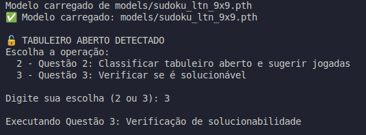

# Sistema LTN para Resolução de Sudoku

## Equipe

- **Bianka Vasconcelos**
- **Micael Viana**
- **Vinicius Chagas**

## Objetivo

Desenvolver uma solução em LTN Torch que resolva o problema do Sudoku com modelos especializados separados para cada dimensão (4x4 e 9x9).

## Características Principais

- **Modelos Separados**: Treinamento independente para Sudoku 4x4 e 9x9
- **Heurísticas Adaptativas**: Estratégias específicas para cada dimensão
- **Base de Conhecimento LTN**: Axiomas e regras lógicas do Sudoku
- **Sistema de Memória**: Rastreamento de heurísticas aplicadas

## Dependências

- torch
- LTN Torch
- numpy
- argparse

## Uso

### Treinamento dos Modelos

Treinamos os modelos usando dados que foram majoriamente gerados por scripts na pasta `/scripts` juntamente a isso utilizamos os sudokus 9x9 disponibilizados pelo site da Kaggle [Referência aqui](https://www.kaggle.com/datasets/bryanpark/sudoku?resource=download).

Treinamos os modelos por 20 épocas para cada caso, tanto 4x4 (para gerar o modelo 4x4) como 9x9 (para gerar o modelo 9x9). Sendo eles os seguintes casos:

- 4x4:
  - Sudokus 4x4 Fechados Válidos
  - Sudokus 4x4 Fechados Inválidos
  - Sudokus 4x4 Abertos Solucionáveis
  - Sudokus 4x4 Abertos Impossíveis
- 9x9:
  - Sudokus 9x9 Fechados Válidos
  - Sudokus 9x9 Fechados Inválidos
  - Sudokus 9x9 Abertos Solucionáveis
  - Sudokus 9x9 Abertos Impossíveis

O modelo 4x4 foi treinado com 20 mil amostras de dados de treinamento para cada um dos casos. Enquanto o modelo 9x9 foi treinado com 500 amostras para cada caso.

#### Treinar Modelo 4x4

```bash
python train_4x4.py --epochs 50
```

#### Treinar Modelo 9x9

```bash
python train_9x9.py --epochs 50
```

### Uso Geral (main.py)

#### Processar arquivo CSV

```bash
python main.py --path data/sudokus/meusudoku.csv
```

#### Treinar modelos separados

```bash
python main.py --train-4x4 --epochs 50
python main.py --train-9x9 --epochs 50
```

## Heurísticas Implementadas

### Básicas

- **Naked Single**: Célula com apenas um candidato possível
- **Hidden Single**: Número que aparece como candidato em apenas uma célula da unidade

### Adaptação por Dimensão

- **4x4**: Heurísticas otimizadas para tabuleiros menores
- **9x9**: Heurísticas completas para tabuleiros padrão

## Base de Conhecimento LTN

O sistema utiliza axiomas lógicos para:

- Constraints básicas do Sudoku (linha, coluna, quadrante)
- Regras de consistência
- Aplicação de heurísticas

## Sistema de Memória

Rastreia:

- Heurísticas aplicadas
- Histórico de movimentos
- Efetividade das estratégias
- Estatísticas de performance

## Resultados Obtidos

Para executar os testes e obter os resultados usamos os comandos:

```bash
python main.py --path sudokus/exemplo_4x4_aberto_valido.csv
python main.py --path sudokus/exemplo_9x9_aberto_valido.csv
```

O sistema possui um mecanismo inteligente que detecta automaticamente qual questão resolver:

- **Questão 1**: Se o tabuleiro está **completamente preenchido** (fechado), o sistema valida se é uma solução válida
- **Questão 2**: Se o tabuleiro tem **células vazias** (aberto), o sistema classifica se é solucionável
- **Questão 3**: Para tabuleiros abertos, o sistema também pode aplicar heurísticas e tentar resolver

#### Exemplo de Saída



### Resultados 4x4

#### Questão 1: Classificação de Tabuleiro Fechado

**Arquivo de teste**: `sudokus/exemplo_4x4_aberto_valido.csv`

**Tabuleiro fechado analisado**:

```
1 2 3 4
3 4 1 2
2 1 4 3
4 3 2 1
```

**Análise**:

- **Tamanho**: 4x4
- **Tipo**: Fechado (completamente preenchido)
- **Tabuleiro válido**: Sim
- **Resultado**: **VÁLIDO**

**Classificação final**: Tabuleiro Sudoku válido e completo

#### Questão 2: Classificação de Tabuleiro Aberto

**Arquivo de teste**: `sudokus/exemplo_4x4_aberto_valido.csv`

**Tabuleiro inicial**:

```
1 . 3 4
3 4 1 .
2 1 4 3
4 3 2 .
```

**Análise**:

- **Tabuleiro válido**: Sim
- **Posições abertas**: 3 células
- **Resultado**: **SOLUCIONÁVEL**

**Jogadas possíveis encontradas**:

1. `(0,1) = 2` - Naked Single
2. `(1,3) = 2` - Naked Single
3. `(3,3) = 1` - Naked Single

#### Questão 3: Verificação de Solucionabilidade

**Mesmo tabuleiro de teste**

**Análise detalhada**:

- **Heurísticas aplicadas**:
  - Naked Singles: 3 encontrados
  - Hidden Singles: 9 encontrados (por linha, coluna e quadrante)
- **Confiança dos movimentos**: 100% para todos os movimentos
- **Resultado**: **SOLUCIONÁVEL**

**Solução encontrada**:

```
1 2 3 4
3 4 1 2
2 1 4 3
4 3 2 1
```

### Resultados 9x9

#### Questão 1: Classificação de Tabuleiro Fechado

**Arquivo de teste**: `sudokus/exemplo_9x9_aberto_valido.csv`

**Tabuleiro fechado analisado**:

```
4 5 8 3 1 2 7 9 6
2 7 1 9 4 6 8 3 5
3 6 9 5 8 7 1 2 4
5 8 7 1 2 9 6 4 3
1 2 3 4 6 8 9 5 7
9 4 6 7 3 5 2 1 8
8 9 5 2 7 3 4 6 1
6 3 4 8 9 1 5 7 2
7 1 2 6 5 4 3 8 9
```

**Análise**:

- **Tamanho**: 9x9
- **Tipo**: Fechado (completamente preenchido)
- **Tabuleiro válido**: Sim
- **Resultado**: **VÁLIDO**

**Classificação final**: Tabuleiro Sudoku válido e completo

#### Questão 2: Classificação de Tabuleiro Aberto

**Arquivo de teste**: `sudokus/exemplo_9x9_aberto_valido.csv`

**Tabuleiro inicial**:

```
2 . 1 4 . . . . .
4 . . . 7 3 5 8 .
. 5 . . . . 6 . .
. . 9 . 2 . 8 . 1
. 2 3 . 1 . . 5 .
. . 8 3 5 4 . . 9
7 . . 2 8 . . . .
. 1 5 . . 9 3 . 6
. 6 . . . . 7 4 .
```

**Análise**:

- **Tabuleiro válido**: Sim
- **Posições abertas**: 47 células
- **Resultado**: **SOLUCIONÁVEL**

**Jogadas possíveis encontradas**:

- **Naked Singles**: 19 encontrados
- **Hidden Singles**: 45 encontrados (por linha, coluna e quadrante)
- **Movimentos com confiança 100%**: 19 movimentos

#### Questão 3: Verificação de Solucionabilidade

**Mesmo tabuleiro de teste**

**Análise detalhada**:

- **Heurísticas aplicadas**:
  - Naked Singles: 19 encontrados
  - Hidden Singles: 45 encontrados (por linha, coluna e quadrante)
- **Confiança dos movimentos**: Variando de 0.20 a 1.00
- **Resultado**: **SOLUCIONÁVEL**

**Processo de resolução**:

- **Iterações realizadas**: 42
- **Células preenchidas**: 41 de 47
- **Posições restantes**: 6 células
- **Status final**: Resolução parcialmente concluída

**Solução parcial encontrada**:

```
2 8 1 4 9 5 9 3 7
4 9 6 1 7 3 5 8 2
3 5 7 8 9 2 6 1 4
5 4 9 6 2 7 8 3 1
6 2 3 9 1 8 4 5 7
1 7 8 3 5 4 2 6 9
7 3 4 2 8 1 9 9 5
8 1 5 7 4 9 3 2 6
9 6 2 5 3 1 7 4 8
```

**Observações**:

- O sistema conseguiu resolver 87% do tabuleiro (41 de 47 células)
- As 6 células restantes não puderam ser resolvidas com as heurísticas disponíveis
- O modelo demonstrou boa capacidade de identificação de padrões e aplicação de estratégias básicas

## Gramática Lógica do Sudoku em LTN

Para que um modelo de rede neural possa aprender as regras e heurísticas do Sudoku, utilizamos o **Logic Tensor Networks (LTN)**. O LTN emprega uma linguagem de primeira ordem diferenciável, chamada _Real Logic_, que permite a fusão de conhecimento simbólico (lógica) com representações de dados sub-simbólicas (tensores).

O conceito central é o **grounding** (denotado por $\mathcal{G}$), que é um mapeamento do domínio lógico (constantes, variáveis, predicados, funções) para o domínio computacional do PyTorch (tensores e redes neurais). Abaixo, detalhamos a gramática específica desenvolvida para este projeto de Sudoku.

### 1. Constantes e Domínios

Os elementos fundamentais do universo Sudoku são aterrados como tensores. A dimensionalidade desses tensores (`dim`) é um hiperparâmetro do modelo.

- **Valores (Digits)**: Representam os números que podem preencher uma célula (e.g., {1, ..., 4} ou {1, ..., 9}). Cada valor `v` é aterrado como um vetor de embedding.

  - $\mathcal{G}(v) \in \mathbb{R}^{dim\_v}$

- **Células (Cells)**: Representam as posições `(i, j)` no tabuleiro. Cada célula `c` é aterrada como um vetor que pode conter suas coordenadas ou outras características posicionais.

  - $\mathcal{G}(c) \in \mathbb{R}^{dim\_c}$

- **Tabuleiros (Boards)**: Um tabuleiro completo `b` é a entrada principal do sistema, representado como uma coleção de valores em células. Seu grounding é um tensor complexo que agrega as informações de todas as células.
  - $\mathcal{G}(b) \in \mathbb{R}^{N \times N \times dim\_v}$ (para um tabuleiro $N \times N$)

### 2. Predicados

Predicados são funções que retornam um valor de verdade no intervalo $[0, 1]$, indicando o grau de satisfação de uma propriedade. Predicados aprendíveis são implementados como redes neurais (MLPs).

- **`hasValue(c, v)`**: Predicado neural **aprendível** que avalia se a célula `c` contém o valor `v`. Este é o predicado central do sistema.

  - **Grounding**: $\mathcal{G}(\text{hasValue}) : \mathbb{R}^{dim\_c} \times \mathbb{R}^{dim\_v} \rightarrow [0, 1]$
  - **Implementação**: $\mathcal{G}(\text{hasValue})(\mathcal{G}(c), \mathcal{G}(v)) = \sigma(\text{MLP}\_{\theta_{val}}(\text{concat}(\mathcal{G}(c), \mathcal{G}(v))))$

- **`isSameRow(c1, c2)`, `isSameCol(c1, c2)`, `isSameBlock(c1, c2)`**: Predicados lógicos **fixos** (não-aprendíveis) que retornam 1.0 se duas células `c1` e `c2` pertencem à mesma linha, coluna ou bloco, e 0.0 caso contrário. Eles injetam conhecimento prévio sobre a estrutura do tabuleiro.

- **`isCorrect(b)` (Questão 1)**: Predicado que avalia se um tabuleiro fechado `b` é uma solução válida. Seu valor de verdade é o resultado da agregação de todos os axiomas de restrição do Sudoku.

- **`hasSolution(b)` (Questão 2)**: Predicado que avalia se um tabuleiro aberto `b` possui ao menos uma solução válida.

- **`recommendsHeuristic(b, h)` (Questão 3)**: Predicado que mede o quão recomendada é a aplicação da heurística `h` no tabuleiro `b`.

### 3. Conectivos e Quantificadores

Os operadores lógicos são traduzidos para operações diferenciáveis sobre tensores, utilizando semântica de lógica fuzzy.

- **Conectivos**:

  - **Conjunção (E, $\land$)**: Mapeado para um t-norm (e.g., produto: $a \cdot b$).
  - **Disjunção (OU, $\lor$)**: Mapeado para um t-conorm (e.g., soma probabilística: $a + b - a \cdot b$).
  - **Negação (NÃO, $\neg$)**: Mapeado como $\neg a = 1 - a$.
  - **Implicação (SE...ENTÃO, $\Rightarrow$)**: Mapeado como $a \Rightarrow b = \neg a \lor b = 1 - a + a \cdot b$.

- **Quantificadores**:
  - **Universal (Para Todo, $\forall$)**: Aterrado como um agregador que exige que a satisfação seja alta para todos os elementos (e.g., `p-mean` com `p` grande, ou simplesmente a média).
  - **Existencial (Existe, $\exists$)**: Aterrado como um agregador que busca ao menos um elemento com alta satisfação (e.g., `p-mean` com `p` pequeno, ou simplesmente o máximo).

### 4. Axiomas Lógicos (Base de Conhecimento)

A base de conhecimento do sistema é formada por axiomas em lógica de primeira ordem que definem as regras do Sudoku. O objetivo do treinamento é ajustar os pesos $\theta$ do predicado `hasValue` para maximizar a satisfação desses axiomas em um conjunto de dados de treinamento.

#### Axiomas de Restrição (Questão 1)

1.  **Existência de Valor na Célula**: Toda célula deve ter (pelo menos) um valor.

    - $\forall c \exists v : \text{hasValue}(c, v)$

2.  **Unicidade de Valor na Célula**: Uma célula não pode ter dois valores diferentes.

    - $\forall c, v_1, v_2 : (\text{hasValue}(c, v_1) \land \text{hasValue}(c, v_2)) \Rightarrow (v_1 = v_2)$

3.  **Restrição de Linha**: Se duas células diferentes estão na mesma linha, elas não podem ter o mesmo valor.

    - $\forall c_1, c_2, v : (\text{isSameRow}(c_1, c_2) \land (c_1 \neq c_2) \land \text{hasValue}(c_1, v)) \Rightarrow \neg \text{hasValue}(c_2, v)$

4.  **Restrição de Coluna**: Idêntico à linha, usando `isSameCol`.

    - $\forall c_1, c_2, v : (\text{isSameCol}(c_1, c_2) \land (c_1 \neq c_2) \land \text{hasValue}(c_1, v)) \Rightarrow \neg \text{hasValue}(c_2, v)$

5.  **Restrição de Bloco**: Idêntico à linha, usando `isSameBlock`.
    - $\forall c_1, c_2, v : (\text{isSameBlock}(c_1, c_2) \land (c_1 \neq c_2) \land \text{hasValue}(c_1, v)) \Rightarrow \neg \text{hasValue}(c_2, v)$

O grounding de `isCorrect(b)` é a conjunção agregada ($\land$) de todos esses axiomas sobre o tabuleiro `b`.

#### Axiomatização de Heurísticas (Questões 2 e 3)

Para tabuleiros abertos, definimos predicados que representam a aplicabilidade de heurísticas. Para isso, introduzimos um predicado auxiliar `isPossible(c, v)`, que é verdadeiro se inserir o valor `v` na célula vazia `c` não viola imediatamente nenhuma das restrições com os números já presentes no tabuleiro.

1.  **Sem Solução (Questão 2.1)**: Um tabuleiro não tem solução se existe um valor que não pode ser colocado em nenhuma célula vazia restante.

    - $\exists v \forall c_{\text{empty}} : \neg \text{isPossible}(c_{\text{empty}}, v)$
    - A probabilidade de um movimento levar a este estado é calculada avaliando a satisfação deste axioma _após_ a jogada hipotética.

2.  **Recomendação de Heurística (Questão 3)**: A recomendação de uma heurística é proporcional à sua confiança (satisfação).

    - **Naked Single**: A heurística `NakedSingle(c, v)` é fortemente recomendada se, para uma célula `c`, existe apenas um valor `v` possível.

      - $\exists! v : \text{isPossible}(c, v)$

    - **Hidden Single**: A heurística `HiddenSingle(u, c, v)` é fortemente recomendada se, para uma unidade `u` (linha, coluna ou bloco), `c` é a única célula onde o valor `v` pode ser jogado.
      - $\exists! c \in u : \text{isPossible}(c, v)$

O aprendizado, portanto, consiste em otimizar os parâmetros das redes neurais ($\theta$) para que as saídas dos predicados aterrados satisfaçam simultaneamente todos esses axiomas lógicos para os dados de treinamento, efetivamente ensinando ao modelo as regras e estratégias do Sudoku.

---

## Referências

- [Dataset Sudoku - Kaggle](https://www.kaggle.com/datasets/bryanpark/sudoku?resource=download)
- [LTN (Logic Tensor Networks)](https://github.com/logictensornetworks/logictensornetworks)
